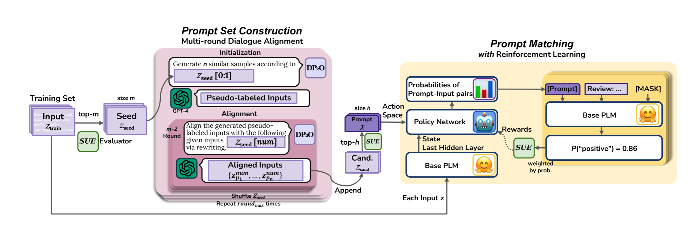

# Dialogue for Prompting: A Policy-Gradient-Based Discrete Prompt Optimization for Few-shot Learning

This repository contains code for *Dialogue for Prompting: A Policy-Gradient-Based Discrete Prompt Optimization for Few-shot Learning* (https://arxiv.org/abs/2308.07272, AAAI 2024) by Chengzhengxu Li, Xiaoming Liu*, Yichen Wang, Duyi Li, Yu Lan, Chao Shen. In this codebase we provide DP2O, a novel discrete prompt optimization method for few-shot learning. DP2O significantly improves the performance of PLMs in various downstream tasks while ensuring prompt readability and transferability. In subsequent analysis , we also verify DP2O’s good universality, robustness, generalization ability, lightweight and efficiency.


# Setting Up

Our codebase requires the following Python and PyTorch versions: 
* Python >= 3.8
* PyTorch >= 1.8.1 (install from the [official website](https://pytorch.org/get-started/locally/))

Install our core modules with
```
git clone https://github.com/czx-li/DP2O.git
```
Train and save our modules
```
python main.py
```
## Citation

If you find our work helpful, please cite us with the following BibTex entry:

```
@article{li2023dialogue,
  title={Dialogue for prompting: a policy-gradient-based discrete prompt optimization for few-shot learning},
  author={Li, Chengzhengxu and Liu, Xiaoming and Wang, Yichen and Li, Duyi and Lan, Yu and Shen, Chao},
  journal={arXiv preprint arXiv:2308.07272},
  year={2023}
}
```

Link to AAAI 2024 version paper: https://ojs.aaai.org/index.php/AAAI/article/view/29809
